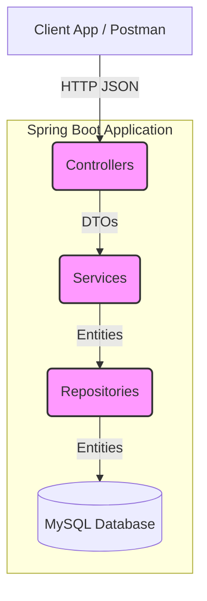
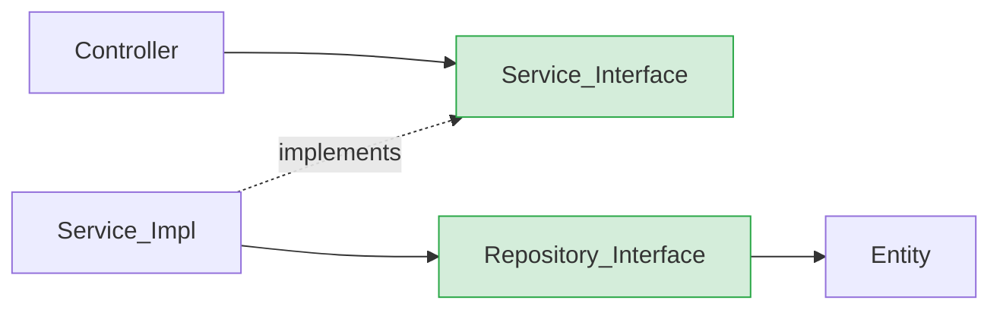
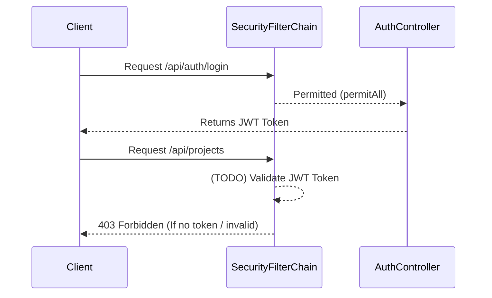
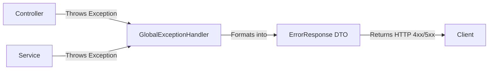

# System Architecture

This document outlines the architectural patterns, structural design, and technical configurations of the `Demo_Prj_Intern` (FreelancerV1) backend system.

## Layered Architecture

The application strictly adheres to the standard **N-Tier Layered Architecture** typical of Spring Boot applications. This separation of concerns ensures maintainability and testability.



1.  **Presentation Layer (Controllers)**: Receives HTTP requests, validates input, and returns HTTP responses.
2.  **Business Logic Layer (Services)**: Contains all business rules, calculations, and orchestrations.
3.  **Data Access Layer (Repositories)**: Abstracts database operations using Spring Data JPA.
4.  **Data Layer (Database)**: Relational data storage (MySQL).

## Package Structure

The source code is organized by **technical capability** (horizontal slicing), ensuring clear boundaries between different types of components.

```
com.example.demo_prj_intern
│
├── config/        # Application settings and Security Filters
├── controller/    # REST API endpoints (@RestController)
├── dto/           # Data Transfer Objects (Requests & Responses)
├── entity/        # Database models (@Entity)
├── exception/     # Global Error Handling (@ControllerAdvice)
├── repository/    # Database interfaces (JpaRepository)
└── service/       # Business logic interfaces
    └── serviceImpl/ # Concrete implementations of Services
```

## Dependency Direction

Dependencies in the system flow strictly downwards. Higher-level layers depend on abstractions (interfaces) of lower-level layers, promoting loose coupling.


*   **Dependency Inversion**: Controllers do not depend on `*ServiceImpl` classes directly. They depend on the `*Service` interfaces.

## Spring Boot Configuration

Configuration is centralized in `src/main/resources/application.properties`.
*   **Server**: Configured to run on port `8080`.
*   **Datasource**: Connects to MySQL via JDBC (`jdbc:mysql://localhost:3306/freelancer_v1`).
*   **JPA/Hibernate**: Uses `org.hibernate.dialect.MySQLDialect`. The schema generation strategy is set to `update` (`spring.jpa.hibernate.ddl-auto=update`), meaning Hibernate automatically alters the database schema to match the Entity classes on startup.

## Security Architecture

Security is handled via Spring Security with a focus on stateless REST APIs.



*   **Stateless Session**: Configured to `SessionCreationPolicy.STATELESS`. No server-side sessions are maintained.
*   **CORS**: A robust CORS configuration is defined via `UrlBasedCorsConfigurationSource`, allowing `*` origins, methods, and headers, specifically tailored for frontend frameworks like Next.js/ReactJS.
*   **CSRF**: Disabled (`AbstractHttpConfigurer::disable`) as it is unnecessary for stateless JWT-based APIs.
*   **Current State**: Currently, `/api/**` is permitted for development purposes, but the architecture is laid out to restrict endpoints using `.anyRequest().authenticated()`.

## DTO Mapping

Data is transferred between the client and the application using Data Transfer Objects (DTOs) located in `dto.request` and `dto.respone`.
*   **Isolation**: Entities are never exposed directly to the Controller layer or serialized to the client. This prevents over-posting attacks and circular reference JSON serialization errors.
*   **Mapping mechanism**: Currently, mapping between DTOs and Entities is handled manually within the `serviceImpl` classes via constructors or setter methods.

## Exception Handling

The system utilizes a global exception handling architecture.



*   **`@ControllerAdvice`**: The `GlobalExceptionHandler` intercepts all unhandled runtime exceptions.
*   **Standardized Output**: It wraps errors into a consistent `ErrorResponse` payload, ensuring the frontend always receives a predictable error format instead of raw stack traces.

## Transaction Management

Database transactions are managed declaratively using Spring's `@Transactional` annotation.
*   Applied predominantly at the **Service layer** (e.g., `AuthServiceImpl.register`, `AuthServiceImpl.oauth2Login`).
*   Ensures Atomicity: If an error occurs during complex operations (like registering a user and creating a wallet simultaneously), the entire transaction rolls back, preventing orphaned data or partial states.

## Repository Pattern

Data access is abstracted using Spring Data JPA.
*   Repositories extend `JpaRepository<Entity, Long>`.
*   Provides out-of-the-box CRUD operations without boilerplate code.
*   Custom queries are handled via derived query methods (e.g., `existsByEmail(String email)` in `UserRepository`).

## Service Responsibilities

The `service` layer acts as the brain of the application.
1.  **Validation**: Enforces business rules (e.g., checking if an email is already registered).
2.  **Orchestration**: Calls multiple repositories (e.g., creating a `UserEntity`, then a `WalletEntity`, then a `FreelancerProfileEntity`).
3.  **Data Transformation**: Converts incoming Request DTOs into Entities, and formats Entities into Response DTOs before returning them to the Controller.
