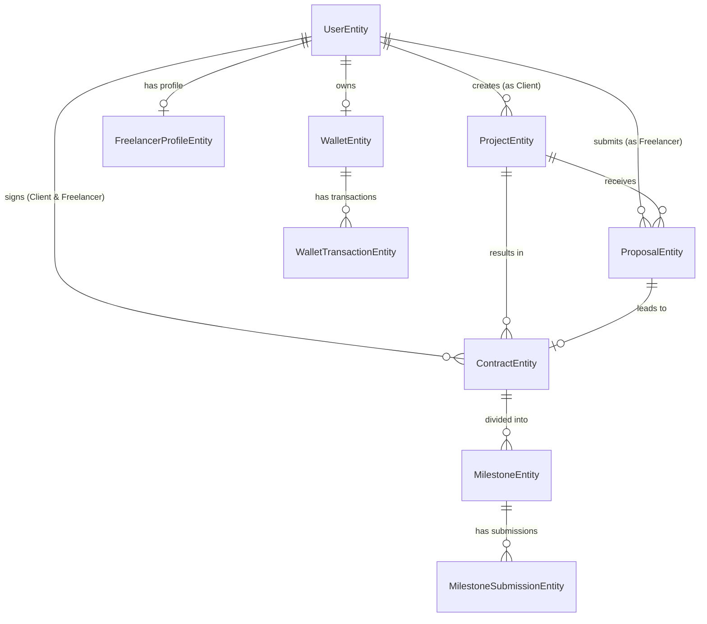

# Database Guide

This document provides a detailed analysis of all database entities in the `Demo_Prj_Intern` project.

## Entity Relationship (ER) Diagram

---

## 1. UserEntity
*   **Purpose**: Stores all registered users (both Clients and Freelancers) and handles authentication details.
*   **Fields**:
    *   `id` (Long, PK)
    *   `email` (String, Unique)
    *   `password` (String)
    *   `role` (String)
    *   `status` (String)
    *   `authProvider` (String)
    *   `createdAt`, `updatedAt` (LocalDateTime)
*   **Relationships**:
    *   `OneToOne` with `FreelancerProfileEntity`
    *   `OneToOne` with `WalletEntity`
    *   `OneToMany` with `ProjectEntity` (As Client)
*   **Constraints**: Email must be unique.
*   **Enum Usage (Simulated via String)**:
    *   `role`: 'ADMIN', 'CLIENT', 'FREELANCER', 'ROLE_PENDING'
    *   `status`: 'PENDING', 'ACTIVE', 'BLOCKED'
    *   `authProvider`: 'LOCAL', 'GOOGLE'

## 2. FreelancerProfileEntity
*   **Purpose**: Stores public portfolio information specific to users with the `FREELANCER` role.
*   **Fields**:
    *   `id` (Long, PK)
    *   `fullName` (String)
    *   `title` (String)
    *   `bio` (String)
    *   `hourlyRate` (BigDecimal)
    *   `skills` (String)
    *   `portfolioUrl` (String)
*   **Relationships**: `OneToOne` with `UserEntity`.
*   **Constraints**: Tied exclusively to a User.

## 3. ProjectEntity
*   **Purpose**: Represents a job/project posted by a Client.
*   **Fields**:
    *   `id` (Long, PK)
    *   `title`, `description` (String)
    *   `budget` (BigDecimal)
    *   `deadline` (LocalDateTime)
    *   `attachmentUrl` (String)
    *   `maxFreelancers` (Integer, default 1)
    *   `status` (String)
    *   `createdAt` (LocalDateTime)
*   **Relationships**:
    *   `ManyToOne` with `UserEntity` (Client)
    *   `OneToMany` with `ProposalEntity`
    *   `OneToMany` with `ContractEntity`
*   **Enum Usage (Simulated via String)**: `status` ('OPEN', 'IN_PROGRESS', 'COMPLETED', 'CANCELLED')

## 4. ProposalEntity
*   **Purpose**: A bid submitted by a Freelancer to work on a specific Project.
*   **Fields**:
    *   `id` (Long, PK)
    *   `proposedPrice` (BigDecimal)
    *   `estimatedDays` (Integer)
    *   `coverLetter` (String)
    *   `status` (String)
    *   `createdAt` (LocalDateTime)
*   **Relationships**:
    *   `ManyToOne` with `ProjectEntity`
    *   `ManyToOne` with `UserEntity` (Freelancer)
*   **Enum Usage (Simulated via String)**: `status` ('PENDING', 'ACCEPTED', 'REJECTED')

## 5. ContractEntity
*   **Purpose**: The formal agreement created when a Client accepts a Freelancer's Proposal.
*   **Fields**:
    *   `id` (Long, PK)
    *   `finalPrice` (BigDecimal)
    *   `contractStatus` (String)
    *   `startedAt`, `completedAt` (LocalDateTime)
*   **Relationships**:
    *   `ManyToOne` with `ProjectEntity`
    *   `ManyToOne` with `UserEntity` (Client)
    *   `ManyToOne` with `UserEntity` (Freelancer)
    *   `OneToOne` with `ProposalEntity`
    *   `OneToMany` with `MilestoneEntity`
*   **Enum Usage (Simulated via String)**: `contractStatus` ('PROCESSING', 'COMPLETED', 'DISPUTED')

## 6. MilestoneEntity
*   **Purpose**: A phased deliverable segment of a Contract with its own allocated budget.
*   **Fields**:
    *   `id` (Long, PK)
    *   `title`, `description` (String)
    *   `amount` (BigDecimal)
    *   `deadline` (LocalDateTime)
    *   `status` (String)
    *   `createdAt`, `updatedAt` (LocalDateTime)
*   **Relationships**:
    *   `ManyToOne` with `ContractEntity`
    *   `OneToMany` with `MilestoneSubmissionEntity`
*   **Enum Usage (Simulated via String)**: `status` ('PENDING', 'FUNDED', 'SUBMITTED', 'RELEASED')

## 7. MilestoneSubmissionEntity
*   **Purpose**: The actual work/deliverable submitted by the Freelancer for a specific Milestone.
*   **Fields**:
    *   `id` (Long, PK)
    *   `freelancerNote` (String)
    *   `submissionUrl` (String)
    *   `submittedAt` (LocalDateTime)
*   **Relationships**: `ManyToOne` with `MilestoneEntity`.

## 8. WalletEntity
*   **Purpose**: Stores the financial balances of a user for internal transactions.
*   **Fields**:
    *   `id` (Long, PK)
    *   `balance` (BigDecimal, Available funds)
    *   `freezingBalance` (BigDecimal, Escrow/Locked funds)
*   **Relationships**:
    *   `OneToOne` with `UserEntity`
    *   `OneToMany` with `WalletTransactionEntity`

## 9. WalletTransactionEntity
*   **Purpose**: An immutable ledger record of all money movements in and out of a Wallet.
*   **Fields**:
    *   `id` (Long, PK)
    *   `amount` (BigDecimal)
    *   `transactionType` (String)
    *   `referenceId` (Long, e.g., Milestone ID or Contract ID)
    *   `createdAt` (LocalDateTime)
*   **Relationships**: `ManyToOne` with `WalletEntity`.
*   **Enum Usage (Simulated via String)**: `transactionType` ('DEPOSIT', 'ESCROW_HOLD', 'ESCROW_RELEASE', 'WITHDRAW', 'REFUND')

---
*Note: Entities such as `Review` or `Notification` do not exist in the current database schema.*
